<p align="center">
  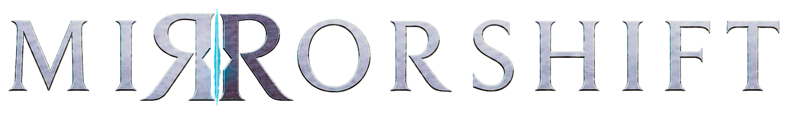
</p>

<p align="center">
  <strong>Two sides. One reality.</strong><br>
  Reversi en red entre la familia ZX Spectrum y los ordenadores actuales.<br>
  <strong>Versión 1.0</strong> · Direct TCP o MQTT · GPL-2.0
</p>

<p align="center">
  <a href="README.md">English</a> ·
  <a href="https://github.com/IgnacioMonge/MirrorShift/releases/latest">Descarga</a> ·
  <a href="docs/README.es.md">Documentación de desarrollo</a> ·
  <a href="client/README.es.md">Guía del cliente Qt</a>
</p>

---

Mirror Shift lleva Reversi en red para dos jugadores a ZX Spectrum Classic,
Spectrum Next, el cartucho SpectraNext y Windows, macOS y Linux.
Juega de Spectrum a Spectrum, de Spectrum a escritorio o entre ordenadores,
con las mismas reglas y el mismo protocolo de juego.

Coloca una ficha en el **Lattice** y captura las fichas contrarias encerradas
entre ella y las tuyas. Cada colocación es un **Alignment**; las capturas
cambian de lado mediante **Mirrorlock**. Un pase forzado es **Silence**, el
empate final es **PARADOX** y **Echoes** lleva tu chat con el otro jugador.

## Por qué Mirror Shift

| | |
| --- | --- |
| **Juega** | Spectrum ↔ Spectrum, Spectrum ↔ escritorio o escritorio ↔ escritorio |
| **Conecta** | Direct TCP con tu rival o MQTT mediante un broker y una sala comunes |
| **Plataformas** | Classic, Next, SpectraNext, Windows, macOS y Linux |
| **Durante la partida** | Pistas legales, marcadores SELF/ECHO, relojes, chat, deshacer y revancha |
| **Continúa después** | Configuración guardada y restauración sincronizada de partidas compatibles |
| **Versiones retro nativas** | TAP + OVL + DAT para Classic; un NEX autocontenido para Next; recurso de cartucho para SpectraNext |

## Contenido

- [Plataformas y protocolos](#plataformas-y-protocolos)
- [Descarga](#descarga)
- [Instalación](#instalación)
- [Inicio rápido](#inicio-rápido)
- [Galería](#galería)
- [Conjuntos de fichas y temas](#conjuntos-de-fichas-y-temas)
- [Uso de Mirror Shift](#uso-de-mirror-shift)
- [Compilar desde el código fuente](#compilar-desde-el-código-fuente)
- [Resolución de problemas](#resolución-de-problemas)
- [Desarrollo](#desarrollo)
- [Créditos y licencia](#créditos-y-licencia)

## Plataformas y protocolos

| Cliente | Plataforma | Modos de red | Distribución |
| --- | --- | --- | --- |
| Escritorio Qt | Windows, macOS, Linux | Direct TCP, MQTT | Paquete de escritorio |
| ZX Spectrum Classic | ZX Spectrum de 48K | Direct TCP, MQTT | `MIRSHIFT.tap` + `MIRSHIFT.OVL` + `MIRSHIFT.DAT` |
| Spectrum Next | ZX Spectrum Next | Direct TCP, MQTT | `MIRSHIFT.nex` |
| SpectraNext | ZX Spectrum con cartucho SpectraNext | Direct TCP, MQTT | Instalador de recurso para el cartucho |

Direct TCP requiere que el invitado pueda acceder a la dirección y al puerto
del anfitrión. Con MQTT, ambos clientes conectan con el mismo broker y sala;
el anfitrión no necesita una conexión entrante desde el invitado.

### Hardware Spectrum

Classic y Next usan un enlace UART-ESP compatible con **ESP-AT**.
Classic necesita además divMMC/esxDOS para sus archivos auxiliares. Una UART
compatible con ZX-Uno requiere control de flujo de transmisión del ESP por
CTS; NetManZX configura este ajuste. Next integra sus assets en el NEX.

SpectraNext es una plataforma de cartucho distinta de Spectrum Next. Usa su
propia red y almacenamiento XFS. El instalador requiere el último firmware
estable del cartucho. Su soporte de reloj usa una
fuente UTC, no un RTC del cartucho.

## Descarga

Descarga las versiones listas para usar desde la
[última release pública](https://github.com/IgnacioMonge/MirrorShift/releases/latest).
Elige el paquete de tu plataforma: portable Windows, aplicación macOS,
AppImage Linux x86_64, los tres archivos Classic, el NEX de Next o el
instalador de recurso SpectraNext.

Usa archivos de la misma versión. Las rutas de compilación y la preparación
del recurso están descritas más abajo y en la
[guía del cartucho](packaging/spectranext/README.md). Consulta las
[notas de la versión 1.0](docs/release-notes-1.0.es.md) y el
[historial de cambios](CHANGELOG.md) para ver el resumen completo.

## Instalación

### Escritorio

Extrae el paquete completo y abre `MirrorShift.exe` en Windows o
`MirrorShift.app` en macOS. En Linux, concede permiso de ejecución al AppImage
y ábrelo. Conserva las bibliotecas, assets y licencias junto a la aplicación.
Las partidas entre ordenadores no requieren hardware Spectrum.

### ZX Spectrum Classic

Copia `MIRSHIFT.tap`, `MIRSHIFT.OVL` y `MIRSHIFT.DAT` al mismo directorio de un
almacenamiento esxDOS escribible. Conserva los nombres y carga `MIRSHIFT.tap`.

### Spectrum Next

Copia `MIRSHIFT.nex` a la tarjeta SD y ábrelo desde el explorador de NextZXOS.
No necesita archivos OVL ni DAT separados.

### Cartucho SpectraNext

1. Actualiza el cartucho al **último firmware estable de SpectraNext** y después
   configura el cartucho y la Wi-Fi siguiendo las
   [instrucciones oficiales de SpectraNext](https://docs.spectranext.net/tutorials/setting-up-mounts).
2. En el menú de SpectraNext, selecciona **Load Resource URL** e introduce:
   <code>https://ignaciomonge.github.io/MirrorShift/</code>
3. El instalador guiado instala Mirror Shift en el almacenamiento local del
   cartucho y lo inicia.
4. En adelante, inicia `MIRSHIFT.ZX` desde el XFS local. Para actualizar Mirror
   Shift, vuelve a usar **Load Resource URL**; la configuración y las partidas
   guardadas se conservan.

<p align="center">
  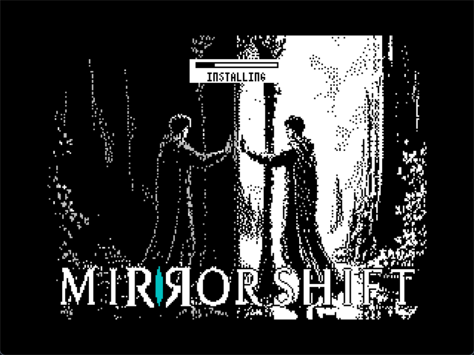<br>
  <sub>El instalador guiado del recurso SpectraNext.</sub>
</p>

Un ZIP de GitHub Releases no es un recurso SpectraNext montable; introduce la
URL HTTPS anterior. La [guía del cartucho](packaging/spectranext/README.md)
describe las pruebas TNFS locales y la compatibilidad entre versiones.

## Inicio rápido

1. Abre Mirror Shift en ambos clientes.
2. Elige **Host** en uno y **Guest** en el otro.
3. Selecciona **Direct** o **MQTT** en ambos.
4. Para Direct, introduce la dirección y el puerto del anfitrión en el invitado.
   Para MQTT, introduce el mismo broker, puerto y sala en ambos clientes.
5. El anfitrión elige el lado e inicia la partida cuando el rival está listo.
6. Coloca una ficha en una casilla legal cuando sea tu turno. Usa Echoes para chatear.

### Direct TCP

El puerto de juego predeterminado es `5000`. En una LAN, usa la dirección local
del anfitrión y permite la conexión en su cortafuegos. Para dos instancias Qt
en el mismo ordenador, usa `127.0.0.1` en el invitado.

### MQTT

Ambos jugadores necesitan acceso al mismo broker, roles complementarios y el
mismo código de sala. El broker transporta los mensajes de juego y presencia.

## Galería

### Escritorio

<table>
  <tr>
    <td align="center" width="33%"><strong>Windows</strong><br>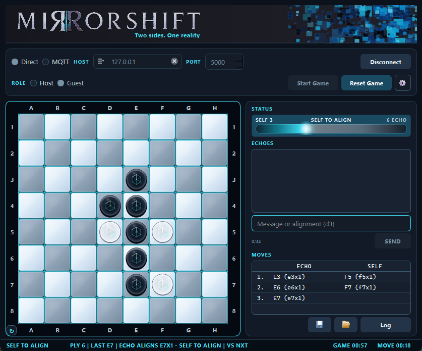</td>
    <td align="center" width="33%"><strong>macOS</strong><br>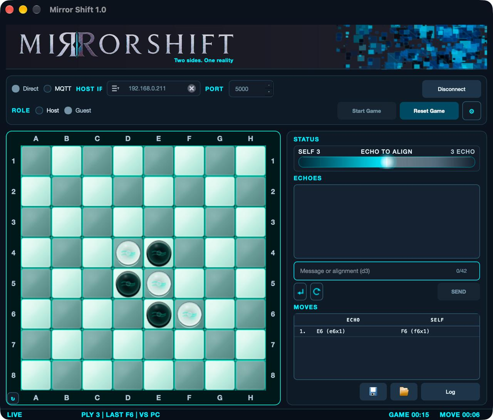</td>
    <td align="center" width="33%"><strong>Linux</strong><br>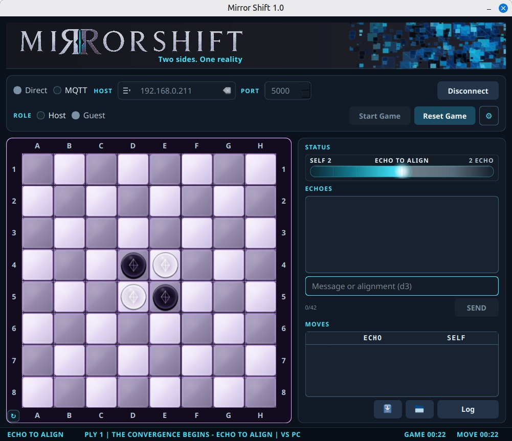</td>
  </tr>
</table>

### ZX Spectrum Classic

<table>
  <tr>
    <td align="center" width="33%"><strong>Configuración</strong><br>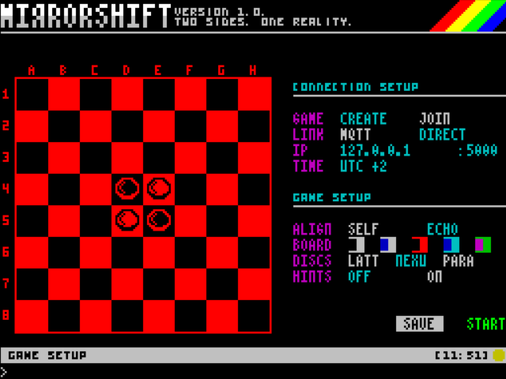</td>
    <td align="center" width="33%"><strong>Partida Direct</strong><br>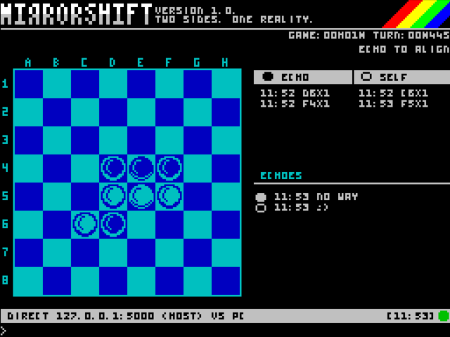</td>
    <td align="center" width="33%"><strong>Partidas guardadas</strong><br>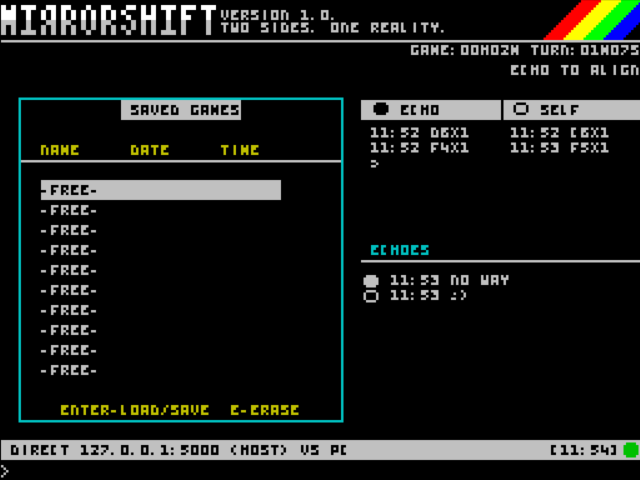</td>
  </tr>
</table>

### Spectrum Next

<table>
  <tr>
    <td align="center" width="33%"><strong>Configuración</strong><br>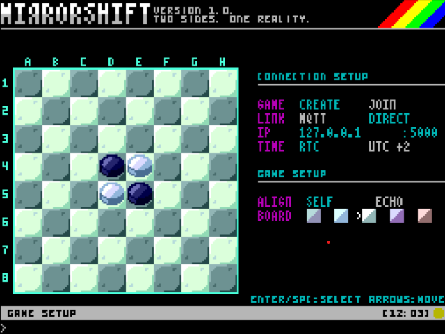</td>
    <td align="center" width="33%"><strong>Partida Direct</strong><br>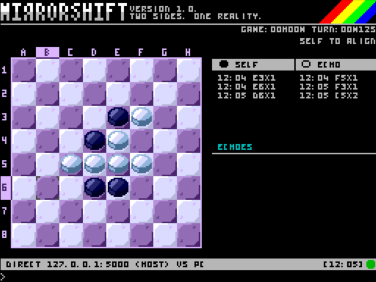</td>
    <td align="center" width="33%"><strong>Solicitud de deshacer</strong><br>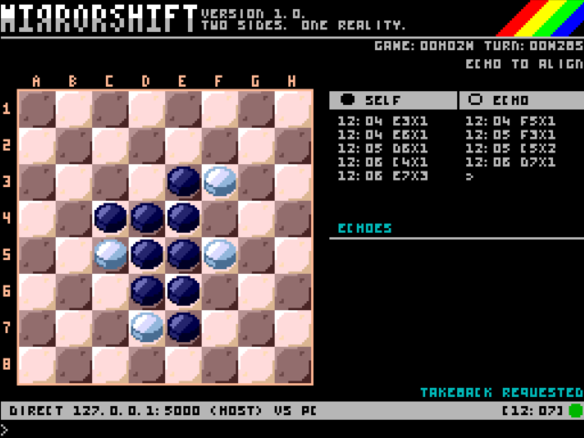</td>
  </tr>
</table>

### SpectraNext

<table>
  <tr>
    <td align="center" width="33%"><strong>Configuración</strong><br>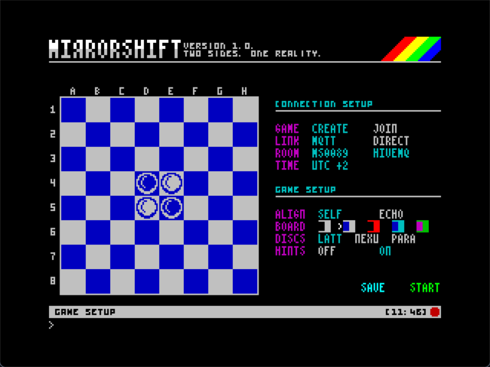</td>
    <td align="center" width="33%"><strong>Partida MQTT</strong><br>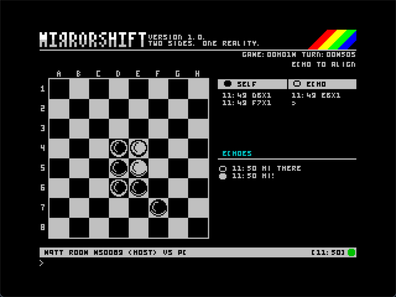</td>
    <td align="center" width="33%"><strong>About</strong><br>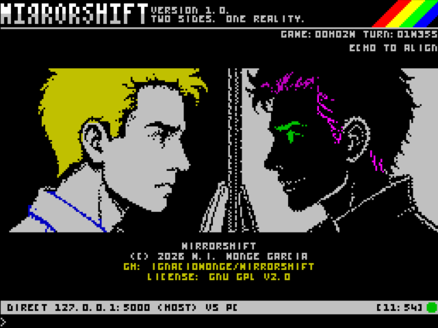</td>
  </tr>
</table>

## Conjuntos de fichas y temas

Classic, Next y SpectraNext ofrecen conjuntos **BW-L**, **BW-M** y **BW-S**
(grande, mediano y pequeño). Elige el conjunto durante la configuración de la
partida. Los temas y el giro cambian la presentación sin alterar las reglas
ni la asignación de jugadores.

Classic y SpectraNext usan cinco paletas de atributos: **Classic**, **Blue**,
**Green**, **Cyan** y **Magenta**. Next usa casillas a todo color y sprites de
hardware. El cursor Next oscuro permanece visible sobre las fichas; en los
clientes Spectrum brillan juntas hasta tres fichas elegibles para señalar
qué lado tiene el turno.

## Uso de Mirror Shift

Encierra al menos una ficha contraria en línea recta para realizar una jugada
legal. Las capturas se resuelven automáticamente en todas las direcciones
afectadas. Si no tienes movimientos legales, Silence pasa el turno de forma
automática. La partida termina cuando ninguno puede mover; gana quien tenga
más fichas. Si las puntuaciones son iguales, se produce PARADOX.

### Controles de escritorio

| Acción | Control |
| --- | --- |
| Configurar una sesión | Elige transporte y rol e introduce los datos de conexión |
| Colocar una ficha | Pulsa una casilla legal cuando sea tu turno |
| Enviar texto | Escribe en Echoes y pulsa Enter |
| Guardar o restaurar | Botones de disco bajo el registro, o `/save [name]` y `/load [name]` |
| Inspeccionar tráfico | Abre Log para ver mensajes RX/TX |
| Cambiar la apariencia | Usa los ajustes del cliente |

El cliente de escritorio recuerda la configuración y las direcciones Direct
recientes. Consulta la [guía Qt](client/README.es.md) para las ranuras y controles.

### Controles Spectrum

| Contexto | Control |
| --- | --- |
| Configuración: cambiar de fila | Cursores Arriba/Abajo o `Q`/`A` |
| Configuración: cambiar una opción | Cursores Izquierda/Derecha u `O`/`P` |
| Configuración: editar o confirmar | Espacio o Enter |
| Tablero: mover el cursor | Cursores o `Q`/`A`/`O`/`P` |
| Tablero: colocar una ficha | Espacio sobre una casilla legal |
| Abrir y enviar la entrada de texto | Enter |
| Abrir el menú de partida | EDIT (`Caps Shift` + `1` en un teclado Classic) |
| Menú FILE | `Q`/`A` selecciona; Enter/Espacio carga o guarda; `E` borra |

El menú de partida ofrece FILE, DISCONNECT, RESET, FLIP, THEME y ABOUT.
Usa Izquierda/Derecha u `O`/`P` y después Espacio/Enter para elegir una acción.

### Comandos de texto

| Entrada | Resultado | Disponibilidad |
| --- | --- | --- |
| `/resign` | Abandonar la partida actual | Qt y Spectrum |
| `/takeback` | Solicitar deshacer la última jugada aplicada | Qt y Spectrum |
| `/save [name]` | Guardar localmente | Qt; usa FILE en Spectrum |
| `/load [name]` | Solicitar restaurar una partida guardada | Qt; usa FILE en Spectrum |

Cualquiera de los jugadores puede iniciar una restauración; el otro debe
aprobarla. La asignación de lado del anfitrión debe coincidir con la sesión
actual. Los guardados `.MSH` versión 2 de Mirror Shift son incompatibles con
los guardados de ajedrez de Shatranj.

## Compilar desde el código fuente

Usa el Makefile del repositorio. Spectrum requiere z88dk/SDCC, Python 3 y
Pillow para generar assets. Los requisitos y comandos de escritorio están en
la [guía del cliente Qt](client/README.es.md).

```sh
make tap              # TAP + OVL + DAT de Classic
make nex              # NEX autocontenido de Spectrum Next
make client-test      # compilación y pruebas Qt
make test             # pruebas de host compartidas y Spectrum
```

Classic genera sus archivos en `release/`; Next escribe
`release/Next/MIRSHIFT.nex`. SpectraNext usa su propio checkout del toolchain:

```sh
make spectranext-resource SPXN_DIR=/path/to/SpectraNext/driver
```

## Resolución de problemas

- **Classic no carga assets:** conserva juntos TAP, OVL y DAT del mismo build.
- **Direct no conecta:** comprueba roles, dirección, puerto y cortafuegos del
  anfitrión. `127.0.0.1` sólo llega al mismo ordenador.
- **No aparece el rival MQTT:** comprueba broker, sala y roles complementarios.
- **Se rechaza un guardado:** usa un archivo Mirror Shift v2 compatible y la
  misma asignación de lado del anfitrión; los archivos truncados o con bytes
  sobrantes también son inválidos.

## Desarrollo

La [documentación de desarrollo](docs/README.es.md) describe arquitectura,
protocolo, validación y mantenimiento de releases. La
[organización del código](docs/source-layout.md) explica las responsabilidades
de cada módulo.

## Créditos y licencia

Mirror Shift parte de Shatranj y conserva sus componentes de red y escritorio
Qt. Las casillas, fichas e identidad gráfica son assets de Mirror Shift; la
procedencia y los originales editables se describen en la
[guía de assets](assets/README.md).

Publicado bajo la [GNU General Public License v2.0](LICENSE). Las dependencias
conservan sus condiciones, recogidas en los [avisos de terceros](THIRD_PARTY_NOTICES.md).
Conserva el código fuente correspondiente y los avisos requeridos con los binarios.

## Autor

**M. Ignacio Monge Garcia — 2026**

Las incidencias y contribuciones son bienvenidas en el
[repositorio oficial](https://github.com/IgnacioMonge/MirrorShift).

<p align="center"><sub>Two sides. One reality.</sub></p>
